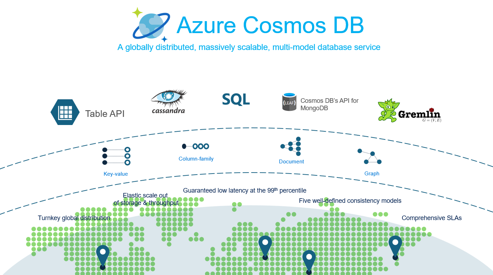
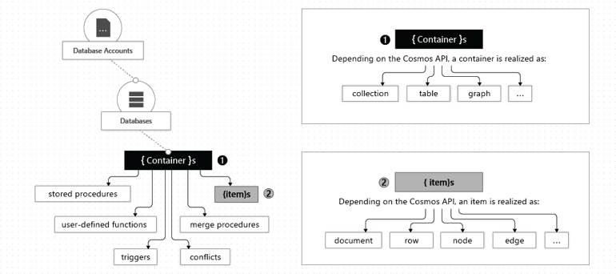
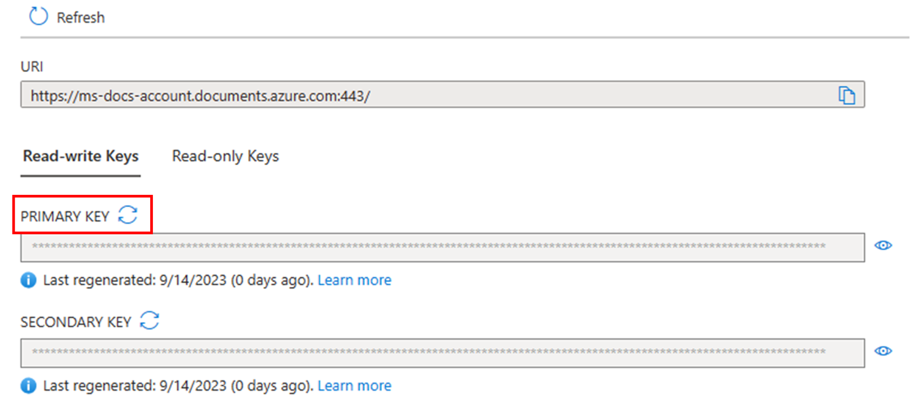
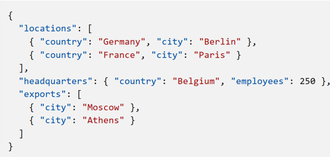
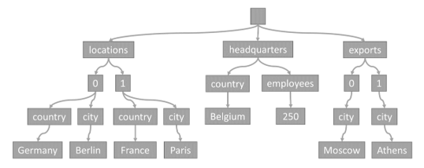
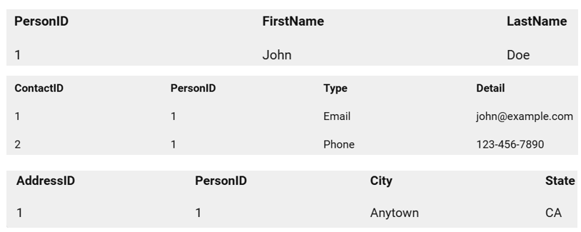
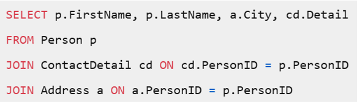
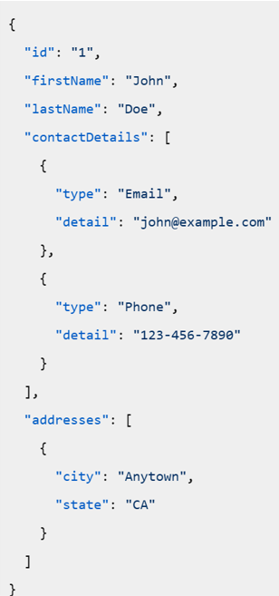

# 10 things dotnet developers need to know while using CosmosDB API for NoSQL

## 1. What is CosmosDB and what is API for NoSQL? 



- Fully managed database service – azure only
- Stores NoSQL, relational and vector data for AI
- You can perform reads and writes with single digit millisecond latency – client same azure region
- Global distribution – multi region, single master multi read, multi master multi read
- You get azure based availability 5 9s and security features like Entra and key vault integration
- Basically you're connecting to your data using an API

### Relational

Azure Cosmos DB also supports relational data models through its PostgreSQL API. This allows you to:
- **Use familiar SQL syntax**: Leverage your existing SQL skills.
- **Transactional support**: Ensure ACID transactions for your applications.
- **Integration with other Azure services**: Seamlessly integrate with Azure services like Azure Functions, Azure Logic Apps, and more⁴.

### Vector

Azure Cosmos DB has introduced vector database capabilities, which are particularly useful for AI and machine learning applications. Key features include:
- **Vector embeddings**: Store and manage high-dimensional vector embeddings for data like text, images, and audio.
- **Vector search**: Perform similarity searches using vector distance or similarity algorithms like DiskANN, which offers high recall and low latency¹².
- **Integrated approach**: Combine vector search with traditional NoSQL or relational queries to enhance data relevance and accuracy¹.

### NoSQL

Azure CosmosDB offers multiple APIs for NoSQL databases, including:
- Native API for NoSQL (focus of this repository)
- MongoDB
- Cassandra
- Gremlin
- Table

Multiple consistency models: Offers five consistency levels to balance between consistency and performance.

## 2. Should I move all my data to CosmosDB immediately?

### Use Cases

- High availability, low latency, and scalability: Applications that require fast access to user data, session management, and real-time updates.
- Internet of Things (IoT) and Telematics: IoT devices generate massive amounts of data that need to be ingested, processed, and analyzed in real-time.
- Retail and Marketing: Retail applications often require real-time inventory management, personalized customer experiences, and transaction processing.
- Gaming: Online games need to manage player data, leaderboards, and game state in real-time. 

### Read-heavy workloads

- Characteristics
  - Frequent reads (e.g. reports): These workloads involve a high volume of read operations compared to write operations.
  - Query heavy: Users expect quick responses to their queries.
- Challenges
  - Getting indexing correct: Indexing is crucial for query performance.
  - Query optimization: Queries should be optimized for performance.
  - Volume: Complex queries can slow down the system as dataset size grows.

### Write-heavy workloads

- Characteristics
  - Frequent writes (e.g. IoT sensor data): These workloads involve a high volume of write operations, such as logging, telemetry, or real-time data ingestion
  - Data Integrity: Ensuring that all writes are accurately recorded and that data integrity is maintained.
  - Throughput: The system must handle a high throughput of write operations without significant delays..
- Challenges
  - Disk I/O bottleneck: High write volumes can overwhelm disk I/O, leading to performance degradation.
  - Lock contention: Concurrent write operations may contend for locks on database resources, causing slowdowns.
  - Index creation: Maintaining indexes on heavily written tables can incur additional overhead.

### Migrate relational to NoSQL data

- Use data migration but in small batches - think [Stangler Fig Pattern](https://en.wikipedia.org/wiki/Strangler_fig_pattern): The Strangler Fig pattern is a strategy for gradually migrating a legacy system to a new architecture by incrementally replacing specific pieces of functionality. This minimizes risk and ensures continuous operation during the migration process.
- Identify Components: Determine which parts of the legacy system can be replaced first.
- Create a Façade: Implement a façade that intercepts requests to the legacy system and routes them to either the old or new system based on the functionality being accessed
- Incremental Replacement: Gradually replace legacy components with new services. The façade ensures that users continue to interact with the system seamlessly.
- Decommission Legacy Data: Once all components have been replaced, the legacy system can be safely decommissioned.

## 3. Where should I store  my data and how do I access it?

### How is the data stored?



- Account has multiple databases and each database can have multiple containers (container of data not docker container)
- Besides storing data, containers also help organize stored procs, UDF, triggers and so on
- You don't start incurring charges until you create containers

### How to access data?



- When you create an account, you get a DNS name where you can connect to access your data
- You can choose to use the keys in a connection string 
- Keep in mind if you use connection string follow best practices
- Do not check in with code
- Store in Key Vault
- If possible don’t use connection strings at all
- Use Managed Identity with your app in azure

### Containers and data

Container can potentially store unlimited data by scaling out. Data is stored in partitions. There are two types of partitions:

- Logical partitions: Logical partition is determined by primary key. It can store up to 20GB of data.
- Physical partitions: Physical partition is determined by system and a physical partition has multiple logical partitions. A physical partition can store up to 50 GB.
 
CosmosDB uses hash-based partitioning to spread logical partitions across physical partitions. Transactions (in stored procedures or triggers) are allowed only against items in a single logical partition.

### Partition Key

The choice of partition key can be crucial for performance. It should be a property that is frequently used in queries and has a high cardinality.

- Any field including /id field: You can use most fields, every document has /id you can use that too depending on circumstance
- Immutable: Be a property that has a value, which doesn't change. If a property is your partition key, you can't update that property's value.
- String-only: Should only contain String values - or numbers should ideally be converted into a String, if there's any chance that they are outside the boundaries of double precision numbers
- High cardinality: Have a high cardinality. In other words, the property should have a wide range of possible values. Should spread the load evenly across containers.
- Picking wrong PK requires migration to fix: If you get it wrong and experience poor performance, you may have to perform data migration.

### Workloads and Partition Keys

- In read-heavy workloads, PKs used frequently in queries. You might want to choose a partition key that appears frequently as a filter in your queries. Queries can be efficiently routed to only the relevant physical partitions by including the partition key in the filter predicate.
- In write-heavy workloads, PKs distribute incoming data uniformly.

## 4. What does the data look like?

### Sample document

```json
{
    "id": "1",
    "userId": "abc",
    "name": "John Doe",
    "email": "john@doe.com",
    "address": {
        "street": "123 Main St",
        "city": "Anytown",
        "state": "NY",
        "zip": "12345"
    },
}
```

- Document data is stored in JSON format. 
- Each document is a self-contained unit of data with a unique id.
- However, the partition key can be any property other than id.
- In this example, userId is used as the partition key instead of id.

### Schema agnostic

- Azure Cosmos DB is schema-agnostic, meaning you can store different types of documents within the same container without predefined schemas.
- This flexibility allows you to evolve your data model without downtime.
- Here’s an example of two different documents in the same container with the same partition key but different fields:
- Both document only have /id required for all records and /userid which is the partition key
- Remaining fields could vary vastly

example of two different documents in the same container with the same partition key but different fields:

```json
{
    "id": "1",
    "userId": "abc",
    "name": "John Doe",
    "email": "john@doe.com",
    "address": {
        "street": "123 Main St",
        "city": "Anytown",
        "state": "NY",
        "zip": "12345"
    },
},
{
    "id": "2",
    "userId": "abc",
    "name": "Jane Doe",
    "email": "jane@doe.com",
    "phone": "123-456-7890"
}
```

### Indexing



Every time an item is stored in a container, its content is projected as a JSON document, then converted into a tree representation. This conversion means that every property of that item gets represented as a node in a tree. A pseudo root node is created as a parent to all the first-level properties of the item. The leaf nodes contain the actual scalar values carried by an item.

As an example, consider above example in which the index tree stores the example JSON data.

Note how arrays are encoded in the tree: every entry in an array gets an intermediate node labeled with the index of that entry within the array (0, 1 etc.).

  - /locations/0/country: "Germany"
  - /locations/0/city: "Berlin"
  - /locations/1/country: "France"
  - /locations/1/city: "Paris"
  - /headquarters/country: "Belgium"
  - /headquarters/employees: 250
  - /exports/0/city: "Moscow"
  - /exports/1/city: "Athens"

Azure Cosmos DB effectively indexes each property's path and its corresponding value when an item is written.

## 5. Convert relational data into NoSQL data

### Denormalization

In a relational database, data is typically normalized to reduce redundancy and ensure data integrity. 
This involves splitting data into multiple tables and using foreign keys to establish relationships. 
For example, consider the following normalized relational tables:



To retrieve a person’s details, you would need to join these tables:



In Cosmos DB, you can denormalize this data into a single document to improve read performance:



### Denormalize by embedding

When modeling data in Cosmos DB, you can choose between embedding data within a document or referencing other documents. 

Each approach has its advantages and use cases.

Embedding involves including related data within the same document.

This is useful when related data is frequently accessed together.

For example, embedding order details within a customer document:

```json
{
    "id": "1",
    "name": "John Doe",
    "email": "john@doe.com",
    "orders": [
        {
            "id": "100",
            "date": "2022-01-01",
            "total": 100.00
        },
        {
            "id": "101",
            "date": "2022-01-02",
            "total": 200.00
        }
    ]
}
```

### Denormalize by referencing

Referencing involves storing related data in separate documents
and using references (e.g., IDs) to link them.

This is useful when related data changes frequently or can grow without bound.

For example, referencing orders in a customer document:
Customer Document with Referenced Orders

```json
{
    "id": "1",
    "name": "John Doe",
    "email": "john@doe.com",
    "orderIds": ["100", "101"]
}
```

Order Document contains reference to customer

```json
{
    "id": "100",
    "customerId": "1",
    "date": "2022-01-01",
    "total": 100.00
}
```

### Embedding v. Referencing

| Embedding | Referencing |
| --- | --- |
| There are contained relationships between entities. | There are one-to-many or many-to-many relationships. |
| Related data is queried together frequently. | Related data changes frequently. |
| The embedded data changes infrequently. | The referenced data can grow without bound. |

## 6. How does a .NET developer perform CRUD

### .NET SDK

- Use latest [.NET SDK](https://learn.microsoft.com/en-us/azure/cosmos-db/nosql/sdk-dotnet-v3) by default
- Current: min recommended 3.35.4

Add the CosmosDB SDK to your dotnet project:

```powershell
dotnet add package Microsoft.Azure.Cosmos
```

Instantiate the CosmosClient using the connection string:

```csharp
CosmosClient client = new CosmosClient(
accountEndpoint: "https://youraccount.documents.azure.com:443/",
accountKey: "yourkey");
```

Instantiate the CosmosClient with Azure credentials:

```csharp
CosmosClient client = new CosmosClient(
accountEndpoint: "https://youraccount.documents.azure.com:443/",
credential: new DefaultAzureCredential());
```

- CosmosClient is thread-safe. 
- Its recommended to maintain a single instance of CosmosClient per lifetime of the application which enables efficient connection management and performance.

Add the CosmosClient to the dependency injection container as a singleton:

```csharp
services.AddSingleton<CosmosClient>(sp =>
{
    return new CosmosClient(
        accountEndpoint: "https://youraccount.documents.azure.com:443/",
        credential: new DefaultAzureCredential());
});
```

Use this CosmosClient instance to create a Database and a Container:

```csharp

    private readonly CosmosClient client;

    public CosmosDbService(CosmosClient client)
    {
        this.client = client;
    }
```

### Create a Database and a Container

```csharp
