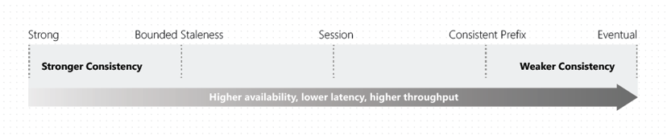
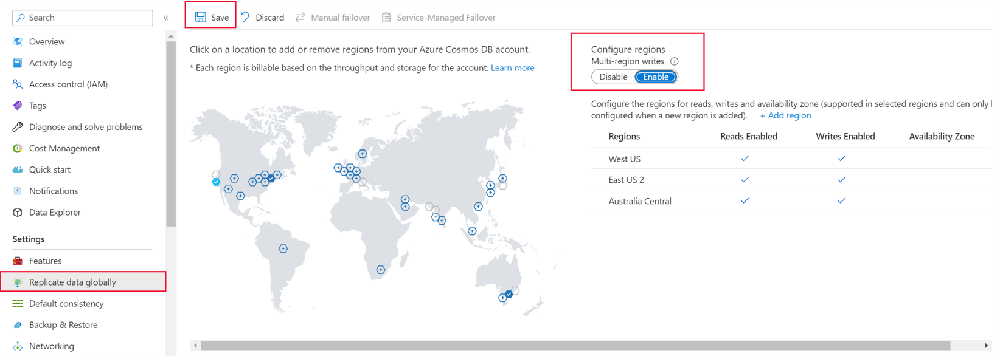
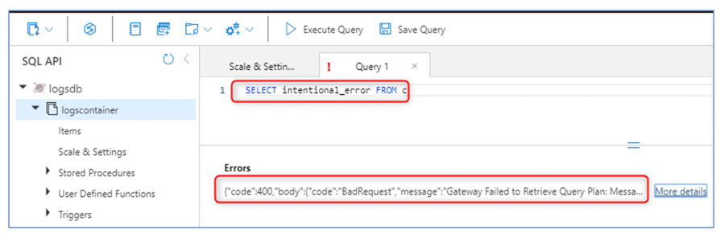
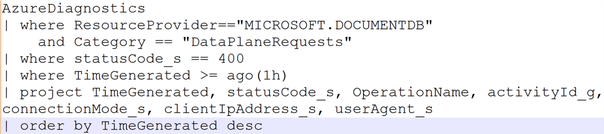

# 10 things dotnet developers need to know while using CosmosDB API for NoSQL

## 1. What is CosmosDB and what is API for NoSQL? 


- Fully managed database service – azure only
- Stores NoSQL, relational and vector data for AI
- You can perform reads and writes with single digit millisecond latency – client same azure region
- Global distribution – multi region, single master multi read, multi master multi read
- You get azure based availability 5 9s and security features like Entra and key vault integration
- Basically you're connecting to your data using an API

### Relational

Azure Cosmos DB also supports relational data models through its PostgreSQL API. This allows you to:
- **Use familiar SQL syntax**: Leverage your existing SQL skills.
- **Transactional support**: Ensure ACID transactions for your applications.
- **Integration with other Azure services**: Seamlessly integrate with Azure services like Azure Functions, Azure Logic Apps, and more⁴.

### Vector

Azure Cosmos DB has introduced vector database capabilities, which are particularly useful for AI and machine learning applications. Key features include:
- **Vector embeddings**: Store and manage high-dimensional vector embeddings for data like text, images, and audio.
- **Vector search**: Perform similarity searches using vector distance or similarity algorithms like DiskANN, which offers high recall and low latency¹².
- **Integrated approach**: Combine vector search with traditional NoSQL or relational queries to enhance data relevance and accuracy¹.

### NoSQL

Azure CosmosDB offers multiple APIs for NoSQL databases, including:
- Native API for NoSQL (focus of this repository)
- MongoDB
- Cassandra
- Gremlin
- Table

Multiple consistency models: Offers five consistency levels to balance between consistency and performance.

## 2. Should I move all my data to CosmosDB immediately?

### Use Cases

- High availability, low latency, and scalability: Applications that require fast access to user data, session management, and real-time updates.
- Internet of Things (IoT) and Telematics: IoT devices generate massive amounts of data that need to be ingested, processed, and analyzed in real-time.
- Retail and Marketing: Retail applications often require real-time inventory management, personalized customer experiences, and transaction processing.
- Gaming: Online games need to manage player data, leaderboards, and game state in real-time. 

### Read-heavy workloads

- Characteristics
  - Frequent reads (e.g. reports): These workloads involve a high volume of read operations compared to write operations.
  - Query heavy: Users expect quick responses to their queries.
- Challenges
  - Getting indexing correct: Indexing is crucial for query performance.
  - Query optimization: Queries should be optimized for performance.
  - Volume: Complex queries can slow down the system as dataset size grows.

### Write-heavy workloads

- Characteristics
  - Frequent writes (e.g. IoT sensor data): These workloads involve a high volume of write operations, such as logging, telemetry, or real-time data ingestion
  - Data Integrity: Ensuring that all writes are accurately recorded and that data integrity is maintained.
  - Throughput: The system must handle a high throughput of write operations without significant delays..
- Challenges
  - Disk I/O bottleneck: High write volumes can overwhelm disk I/O, leading to performance degradation.
  - Lock contention: Concurrent write operations may contend for locks on database resources, causing slowdowns.
  - Index creation: Maintaining indexes on heavily written tables can incur additional overhead.

### Migrate relational to NoSQL data

- Use data migration but in small batches - think [Stangler Fig Pattern](https://en.wikipedia.org/wiki/Strangler_fig_pattern): The Strangler Fig pattern is a strategy for gradually migrating a legacy system to a new architecture by incrementally replacing specific pieces of functionality. This minimizes risk and ensures continuous operation during the migration process.
- Identify Components: Determine which parts of the legacy system can be replaced first.
- Create a Façade: Implement a façade that intercepts requests to the legacy system and routes them to either the old or new system based on the functionality being accessed
- Incremental Replacement: Gradually replace legacy components with new services. The façade ensures that users continue to interact with the system seamlessly.
- Decommission Legacy Data: Once all components have been replaced, the legacy system can be safely decommissioned.

## 3. Where should I store  my data and how do I access it?

### How is the data stored?


- Account has multiple databases and each database can have multiple containers (container of data not docker container)
- Besides storing data, containers also help organize stored procs, UDF, triggers and so on
- You don't start incurring charges until you create containers

### How to access data?


- When you create an account, you get a DNS name where you can connect to access your data
- You can choose to use the keys in a connection string 
- Keep in mind if you use connection string follow best practices
- Do not check in with code
- Store in Key Vault
- If possible don’t use connection strings at all
- Use Managed Identity with your app in azure

### Containers and data

Container can potentially store unlimited data by scaling out. Data is stored in partitions. There are two types of partitions:

- Logical partitions: Logical partition is determined by primary key. It can store up to 20GB of data.
- Physical partitions: Physical partition is determined by system and a physical partition has multiple logical partitions. A physical partition can store up to 50 GB.
 
CosmosDB uses hash-based partitioning to spread logical partitions across physical partitions. Transactions (in stored procedures or triggers) are allowed only against items in a single logical partition.

### Partition Key

The choice of partition key can be crucial for performance. It should be a property that is frequently used in queries and has a high cardinality.

- Any field including /id field: You can use most fields, every document has /id you can use that too depending on circumstance
- Immutable: Be a property that has a value, which doesn't change. If a property is your partition key, you can't update that property's value.
- String-only: Should only contain String values - or numbers should ideally be converted into a String, if there's any chance that they are outside the boundaries of double precision numbers
- High cardinality: Have a high cardinality. In other words, the property should have a wide range of possible values. Should spread the load evenly across containers.
- Picking wrong PK requires migration to fix: If you get it wrong and experience poor performance, you may have to perform data migration.

### Workloads and Partition Keys

- In read-heavy workloads, PKs used frequently in queries. You might want to choose a partition key that appears frequently as a filter in your queries. Queries can be efficiently routed to only the relevant physical partitions by including the partition key in the filter predicate.
- In write-heavy workloads, PKs distribute incoming data uniformly.

## 4. What does the data look like?

### Sample document

```json
{
    "id": "1",
    "userId": "abc",
    "name": "John Doe",
    "email": "john@doe.com",
    "address": {
        "street": "123 Main St",
        "city": "Anytown",
        "state": "NY",
        "zip": "12345"
    },
}
```

- Document data is stored in JSON format. 
- Each document is a self-contained unit of data with a unique id.
- However, the partition key can be any property other than id.
- In this example, userId is used as the partition key instead of id.

### Schema agnostic

- Azure Cosmos DB is schema-agnostic, meaning you can store different types of documents within the same container without predefined schemas.
- This flexibility allows you to evolve your data model without downtime.
- Here’s an example of two different documents in the same container with the same partition key but different fields:
- Both document only have /id required for all records and /userid which is the partition key
- Remaining fields could vary vastly

example of two different documents in the same container with the same partition key but different fields:

```json
{
    "id": "1",
    "userId": "abc",
    "name": "John Doe",
    "email": "john@doe.com",
    "address": {
        "street": "123 Main St",
        "city": "Anytown",
        "state": "NY",
        "zip": "12345"
    },
},
{
    "id": "2",
    "userId": "abc",
    "name": "Jane Doe",
    "email": "jane@doe.com",
    "phone": "123-456-7890"
}
```

### Indexing


Every time an item is stored in a container, its content is projected as a JSON document, then converted into a tree representation. This conversion means that every property of that item gets represented as a node in a tree. A pseudo root node is created as a parent to all the first-level properties of the item. The leaf nodes contain the actual scalar values carried by an item.

As an example, consider above example in which the index tree stores the example JSON data.

Note how arrays are encoded in the tree: every entry in an array gets an intermediate node labeled with the index of that entry within the array (0, 1 etc.).

  - /locations/0/country: "Germany"
  - /locations/0/city: "Berlin"
  - /locations/1/country: "France"
  - /locations/1/city: "Paris"
  - /headquarters/country: "Belgium"
  - /headquarters/employees: 250
  - /exports/0/city: "Moscow"
  - /exports/1/city: "Athens"

Azure Cosmos DB effectively indexes each property's path and its corresponding value when an item is written.

## 5. Convert relational data into NoSQL data

### Denormalization

In a relational database, data is typically normalized to reduce redundancy and ensure data integrity. 
This involves splitting data into multiple tables and using foreign keys to establish relationships. 
For example, consider the following normalized relational tables:


To retrieve a person’s details, you would need to join these tables:


In Cosmos DB, you can denormalize this data into a single document to improve read performance:


### Denormalize by embedding

When modeling data in Cosmos DB, you can choose between embedding data within a document or referencing other documents. 

Each approach has its advantages and use cases.

Embedding involves including related data within the same document.

This is useful when related data is frequently accessed together.

For example, embedding order details within a customer document:

```json
{
    "id": "1",
    "name": "John Doe",
    "email": "john@doe.com",
    "orders": [
        {
            "id": "100",
            "date": "2022-01-01",
            "total": 100.00
        },
        {
            "id": "101",
            "date": "2022-01-02",
            "total": 200.00
        }
    ]
}
```

### Denormalize by referencing

Referencing involves storing related data in separate documents
and using references (e.g., IDs) to link them.

This is useful when related data changes frequently or can grow without bound.

For example, referencing orders in a customer document:
Customer Document with Referenced Orders

```json
{
    "id": "1",
    "name": "John Doe",
    "email": "john@doe.com",
    "orderIds": ["100", "101"]
}
```

Order Document contains reference to customer

```json
{
    "id": "100",
    "customerId": "1",
    "date": "2022-01-01",
    "total": 100.00
}
```

### Embedding v. Referencing

| Embedding | Referencing |
| --- | --- |
| There are contained relationships between entities. | There are one-to-many or many-to-many relationships. |
| Related data is queried together frequently. | Related data changes frequently. |
| The embedded data changes infrequently. | The referenced data can grow without bound. |

## 6. How does a .NET developer perform CRUD

### .NET SDK

- Use latest [.NET SDK](https://learn.microsoft.com/en-us/azure/cosmos-db/nosql/sdk-dotnet-v3) by default
- Current: min recommended 3.35.4

Add the CosmosDB SDK to your dotnet project:

```powershell
dotnet add package Microsoft.Azure.Cosmos
```

### Cosmos Client and Singleton

Instantiate the CosmosClient using the connection string:

```csharp
CosmosClient client = new CosmosClient(
accountEndpoint: "https://youraccount.documents.azure.com:443/",
accountKey: "yourkey");
```

Instantiate the CosmosClient with Azure credentials:

```csharp
CosmosClient client = new CosmosClient(
accountEndpoint: "https://youraccount.documents.azure.com:443/",
credential: new DefaultAzureCredential());
```

- CosmosClient is thread-safe. 
- Its recommended to maintain a single instance of CosmosClient per lifetime of the application which enables efficient connection management and performance.

Add the CosmosClient to the dependency injection container as a singleton:

```csharp
services.AddSingleton<CosmosClient>(sp =>
{
    return new CosmosClient(
        accountEndpoint: "https://youraccount.documents.azure.com:443/",
        credential: new DefaultAzureCredential());
});
```

### What happens when you don't use Singleton

- Increased Latency: Each new instance of CosmosClient requires initialization, which includes reading account information, container information, and partition layout.
- Resource Exhaustion: Creating multiple instances of CosmosClient can lead to ephemeral port exhaustion, as each instance opens new connections.
- Thread Pool Starvation: If multiple CosmosClient instances are used synchronously, it can lead to thread pool starvation. This happens because synchronous operations block threads, reducing the availability of threads for other tasks.
- Inconsistent Configuration: Multiple instances of CosmosClient can lead to inconsistent configuration settings, such as connection policies, retry options, and consistency levels.

### Create a Database and a Container (check for pre-existing)

Use this CosmosClient instance to create a Database and a Container:

```csharp

    private readonly CosmosClient client;

    public CosmosDbService(CosmosClient client)
    {
        this.client = client;
    }
```

- Check if a database exists, and if it doesn't, create it. 
- Defensive programming
- Expensive because it performs a pre-check
- Database pIf you use create only, you would have to perform error catch to ensure no duplicates
- Properties such as throughput are not validated and can be different then the passed properties.

```csharp
DatabaseResponse database = await client.CreateDatabaseIfNotExistsAsync("MyDatabase");
ContainerResponse container = await database.Database.CreateContainerIfNotExistsAsync("MyContainer", "/partitionKey");
```

Or you can create a Database and a Container using create only, and perform try catch to ensure no duplicates

```csharp
try
{
    DatabaseResponse database = await client.CreateDatabaseAsync("MyDatabase");
    ContainerResponse container = await database.Database.CreateContainerAsync("MyContainer", "/partitionKey");
}
catch (CosmosException ex) when (ex.StatusCode == HttpStatusCode.Conflict)
{
    // Database or Container already exists
}
```

### Create versus Upsert

- CreateItemAsync is best for scenarios where you need to ensure that no duplicate items are inserted and are prepared to handle conflicts if the item already exists.
- Ensures uniqueness but could throw error if item with same id exists

```csharp
ItemResponse<MyItem> response = await container.CreateItemAsync<MyItem>(id: new MyItem { Id = "1", Name = "John Doe" }, partitionKey: new PartitionKey("partitionKey"));
```

- UpsertItemAsync is ideal for scenarios where you want to simplify the logic by combining insert and update operations, ensuring the item is present without worrying about duplicates.
- Upserts are idempotent: safe to call mutiple times without creating duplicates and handles both insert and updates.
- Expensive due to check

```csharp
ItemResponse<MyItem> response = await container.UpsertItemAsync<MyItem>(item:new MyItem { Id = "1", Name = "John Doe" }, partitionKey: new PartitionKey("partitionKey"));
```

### Point Reads versus Queries

use point reads when you need to retrieve a single item by its ID and partition key for maximum efficiency.

```chsarp
ItemResponse<MyItem> response = await container.ReadItemAsync<MyItem>(id: "1", partitionKey: new PartitionKey("partitionKey"));
```

Use queries when you need more flexibility to filter and retrieve multiple items.

```csharp
QueryDefinition queryDefinition = new QueryDefinition("SELECT * FROM c WHERE c.lastname = @lastname AND c.partitionKey = @partitionKey")
    .WithParameter("@lastname", "Doe");
    .WithParameter("@partitionKey", "1");
```

## 7. Considerations for global distribution

### Consistency



**Strong Consistency**

Reads always return the most recent committed write. This level provides the highest consistency but at the cost of higher latency and reduced availability during failures.
Use Case: Financial transactions where it is crucial to always have the most up-to-date information, such as banking applications.

**Bounded Staleness**

Guarantees that reads are not too out-of-date. You can configure the staleness window in terms of time or number of versions.
Use Case: Social media feeds where it is acceptable for the data to be slightly out-of-date but still relatively fresh.

**Session Consistency**

Guarantees consistency within a single session. User or application needs to see their own writes immediately.
Use Case: Shopping cart applications where a user needs to see their own updates immediately but can tolerate some delay in seeing updates from others.

**Consistent Prefix** 

Guarantees that reads never see out-of-order writes. This level ensures that if a sequence of writes is performed in a specific order, reads will see the writes in the same order.
Use Case: Event logging systems where the order of events is crucial, such as in monitoring and alerting systems.

**Eventual Consistency**

Guarantees that, eventually, all replicas will converge. This level offers the highest availability and lowest latency but does not guarantee immediate consistency.
Use Case: Product catalog applications where it is acceptable for the data to be eventually consistent, such as in e-commerce websites

### Single-region versus multi-region writes



**Single-Write Region**

In a single-write region configuration, one region is designated as the primary write region, and all other regions are read-only replicas. Writes are directed to the primary region and then replicated to the read regions. This setup is simpler but can lead to higher latency for write operations if the primary region is far from the user.

Example: A company with a primary user base in North America might choose a single-write region in the US, with read replicas in Europe and Asia to serve global read requests.

**Multi-Write Regions**

In a multi-write region configuration, multiple regions can accept write operations. This setup provides several benefits:

- Low Latency Writes: Users can write to the nearest region, reducing latency.
- High Availability: If one region goes down, other regions can continue to accept writes, ensuring near-zero downtime.
- Conflict Resolution: Writes in different regions may lead to conflicts. Cosmos DB uses a conflict resolution policy to handle these conflicts, ensuring data consistency across regions.

Example: An IoT application with devices distributed globally can benefit from multi-write regions

### Configuring app and code for multi-region

- Co-locate app with write region(s)
- Set Application Region: Use ApplicationRegion property in CosmosClientOptions to specify region where application is deployed. This ensures that the SDK directs write operations to the nearest region.
- ApplicationPreferredRegions: This property allows you to specify a list of preferred regions in order of priority. This is useful when you want more granular control over which regions to use for read and write operations. The SDK will attempt to use the regions in the order specified.

```csharp
CosmosClientOptions options = new CosmosClientOptions()
{
    ApplicationRegion = Regions.EastUS,
    ApplicationPreferredRegions = new List<string> { "East US", "West US" }
};
```

## 8. How do I measure performance / throughput?

### Request Units (RUs)

- Currency: Request Units (RUs) are the currency for throughput in Azure Cosmos DB. 
- CPU + IOPS + Mem: They abstract the system resources (CPU, IOPS, and memory) required to perform database operations. 
- Ops consume RUs based on complexity: Each operation, whether it’s a read, write, or query, consumes a certain number of RUs based on its complexity
- Examples (for 1KB doc):
  - Point-read: 1 RU
  - Write: 5 RU
  - Query: it depends

### How to estimate RUs

- Run operations on representative data
- Capture RUs for each operation
- For each operation, multiply RU * number of operations

Query 1: 
select * from c where c.name == 'ABC'
RU for 1 run = 26.18 RUs
Estimated 100 queries per second
Total for query 1 = 26.18 * 100 = 2618 RUs
Repeat for other operations and total

### Obtain RUs in .NET code

To get the RU charge for an operation in the .NET SDK v3, you can access the RequestCharge property from the response object.

```csharp
ItemResponse<MyItem> response = await container.ReadItemAsync<MyItem>(id: "1", partitionKey: new PartitionKey("partitionKey"));
double requestCharge = response.RequestCharge;
```

You should be running this constantly at least in dev and have the ability to record in prod on demand

You can also set the RU charge manually for each operation using RequestOptions:

```csharp
ItemResponse<MyItem> response = await container.ReadItemAsync<MyItem>(id: "1", partitionKey: new PartitionKey("partitionKey"), requestOptions: new ItemRequestOptions { OfferThroughput = 400 });
```

### What happens when you run out of RUs?

This is what a throttling error looks like:

```json
{
    "code": "429",
    "message": "Request rate is large",
    "retryAfterMs": 1000
}
```

- Throttling: If you exceed the provisioned RUs, Cosmos DB will throttle your requests. This can lead to increased latency and timeouts.
- For workloads that aren't sensitive to latency, you can provision less throughput and let the application handle rate-limiting when the actual throughput exceeds the provisioned throughput. 
- The server will preemptively end the request with RequestRateTooLarge (HTTP status code 429) and return the x-ms-retry-after-ms header indicating the amount of time, in milliseconds, that the user must wait before retrying the request.

### Backoffs and retries

.NET SDK will implicitly catch this response, respect the server-specified retry-after header, and retry the request.Unless your account is accessed concurrently by multiple clients, the next retry will succeed.

If you have more than one client cumulatively operating consistently above the request rate, the default retry count, which is currently set to 9, may not be sufficient.

In such cases, the client throws a RequestRateTooLargeException with status code 429 to the application. 

The default retry count can be changed by setting the RetryOptions on the ConnectionPolicy instance. 

By default, the RequestRateTooLargeException with status code 429 is returned after a cumulative wait time of 30 seconds if the request continues to operate above the request rate. This occurs even when the current retry count is less than the max retry count, be it the default of 9 or a user-defined value.


You can use the ConnectionPolicy to configure retries and backoff policies:

```csharp
ConnectionPolicy connectionPolicy = new ConnectionPolicy
{
    RetryOptions = new RetryOptions
    {
        MaxRetryAttemptsOnThrottledRequests = 9,
        MaxRetryWaitTimeInSeconds = 30
    }
};
```

MaxRetryAttemptsOnThrottledRequests is set to 3, so in this case, if a request operation is rate limited by exceeding the reserved throughput for the container, the request operation retries three times before throwing the exception to the application. MaxRetryWaitTimeInSeconds is set to 60, so in this case if the cumulative retry wait time in seconds since the first request exceeds 60 seconds, the exception is thrown.

## 9. Async, Stream and Parallelism

Asynchronous programming allows your application to perform other tasks while waiting for I/O operations to complete. This is particularly important for database operations, which can be time-consuming.

In this example, the UpsertItemAsync method allows the application to continue executing other code while waiting for the read operation to complete.

```csharp
ItemResponse<MyItem> response = await container.UpsertItemAsync<MyItem>(item: new MyItem { Id = "1", Name = "John Doe" }, partitionKey: new PartitionKey("partitionKey"));
```

- Avoid blocking calls: Task.Result, Task.Wait, and Task.GetAwaiter().GetResult(). 
- The entire call stack is asynchronous in order to benefit from async/await patterns. 
- Many synchronous blocking calls lead to Thread Pool starvation and degraded response times.

### StreamAPI

- Stream instead of serialize-deserialize: The Stream API enables applications to receive and return data as streams, bypassing the need for serialization and deserialization. This means data is handled in its raw form, which can significantly reduce processing overhead and improve performance.
- Improved perf: By avoiding the serialization process, the Stream API can improve the performance of read and write operations. This is particularly beneficial for applications that need to handle large volumes of data quickly
- Middle-tier applications: Applications that act as intermediaries, relaying data between different services or tiers, can benefit from the Stream API. These applications can pass data along without the need to serialize and deserialize it, thus saving time and resources.

### Parallelism

The MaxConcurrency property specifies the maximum number of concurrent operations that can be run client-side during parallel query execution. Setting this property helps control the degree of parallelism.

```csharp
FeedIterator<MyItem> query = container.GetItemQueryIterator<MyItem>(queryDefinition);
FeedResponse<MyItem> response = await query.ReadNextAsync(maxConcurrency: 10);
```

The MaxBufferedItemCount property specifies the maximum number of items that can be buffered client-side during parallel query execution. This helps control the amount of prefetched data.

```csharp
FeedIterator<MyItem> query = container.GetItemQueryIterator<MyItem>(queryDefinition);
FeedResponse<MyItem> response = await query.ReadNextAsync(maxBufferedItemCount: 100);
```

- Start with High Values: Begin with high values for MaxConcurrency (e.g., int.MaxValue) to achieve the best latency and then adjust based on resource constraints.
- Monitor and Adjust: Use Azure Monitor and Application Insights to monitor CPU usage and query performance. Adjust MaxConcurrency and MaxBufferedItemCount based on observed performance and resource usage.
- Balance Parallelism and Resource Usage: Find a balance between parallelism and resource usage to avoid high CPU and memory consumption while maintaining good performance.

## 10. Logging and diagnostics

### Diagnostics Logs on portal

Enable diagnostics settings on your azure account

This query is intentionally incorrect, we should get as a result a BadRequest error with 400 code. 



Go back to Logs from the Azure Cosmos DB menu and execute this diagnostic query. And you will find the 400 error in the logs.



### Tracers

Some environments have the .NET DefaultTraceListener enabled. The DefaultTraceListener poses performance issues on production environments causing high CPU and I/O bottlenecks. Check and make sure that the DefaultTraceListener is disabled for your application by removing it from the TraceListeners on production environments.
 
Latest SDK versions (greater than 3.23.0) automatically remove it when they detect it, with older versions, you can remove it by:

```csharp
DefaultTrace.TraceSource.Switch.Level = SourceLevels.Off;
```
